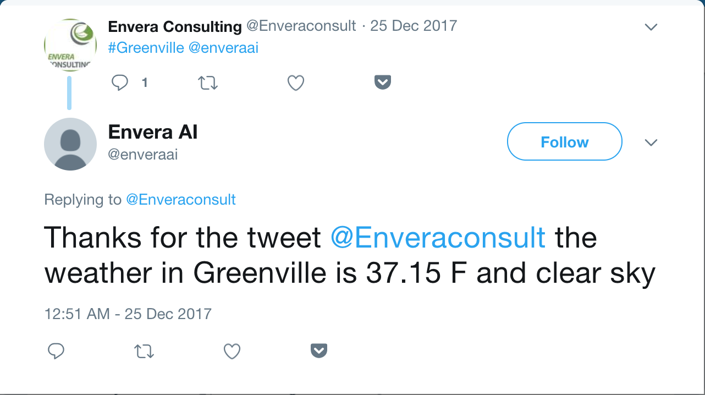
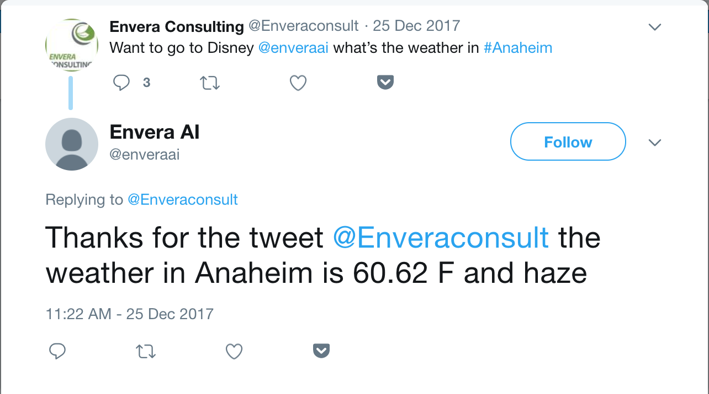
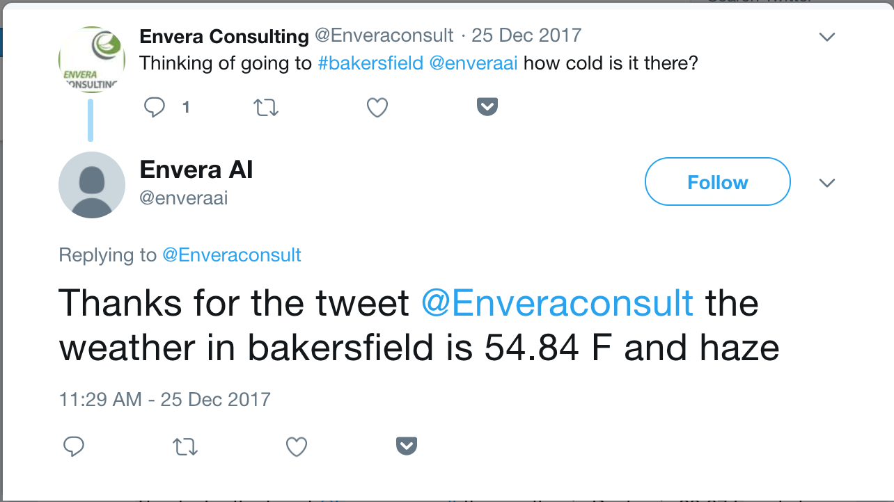

# Tell Me Something About The Weather (Python Twitter Bot)

For this project, I created a Python Twitter Bot that responded to inquires about the weather for a given city. 

The general premise for this bot is that the bot scans and analyzes the last tweet in the Twitter feed of a given user, in this case, the user was `@enveraai` for a city, that was in the form of a hastag (e.g., `#honolulu`). 

When the bot found a hashtag in the latest tweet, the string was extracted, and then an API call was made to openweather.org to obtain the corresponding weather data for the city.  

For example, in the case of the tweet, `#Greenville @enveraai` an API call would be made to open weather for the city of 'Greenville'.

Once the API call was made, the json was parsed to return the weather, in deg. F as well as the conditions.

With those data in hand, stored in variables, a response tweet is created and responds to the original tweet.

### Tech Stack

For this Twitter bot, I used Python, Requests and the Tweepy wrapper.  In order to scan and post from my Twitter account, I needed to set up an app on my Twitter account.  Lastly, I needed to register on openweather.org in order to get an API key.

### Future Work
For this bot, one problem that I ran into is the fact that a proper API cannot be made if the city has two or more words like 'Los Angeles.'

In this case, a proper API call cannot be made for `#losangeles` and therefore a response tweet cannot be sent. 

Since the Twitter API stores all of the hastags in a tweet in the form of a list, within the json, it is possible to build a proper connection url if the hashtag is `#los#angeles`.  In this case, I would need to loop through the list and concatenate all of the list elements together into a string that I can use with the open weather API.

### Bot in Action
You can check out a few photos of this bot in action.  I normally don't run this bot because it would require me to have the script running 24/7, and I don't think it's necessary.

***